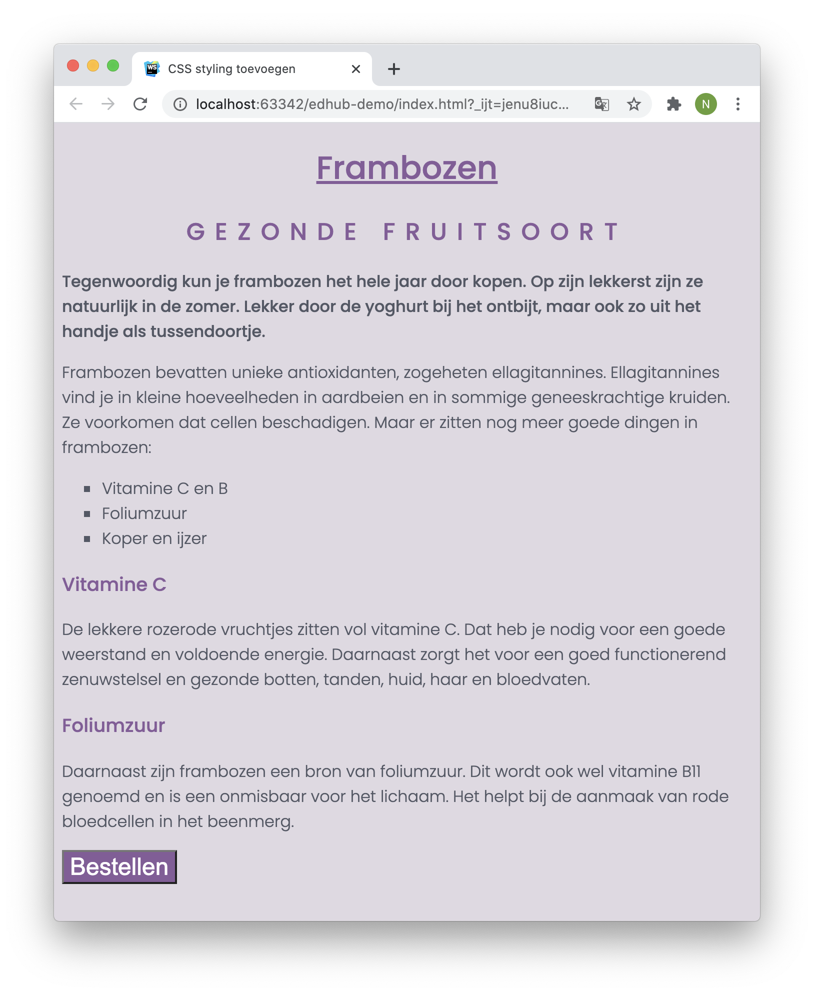

# Opdracht beschrijving

## Eindresultaat
Je bent er nu helemaal klaar voor om al deze nieuw-geleerde stijlregels in de praktijk te brengen. Wellicht moet je een paar keer terug om de desbetreffende paragraaf te raadplegen, maar dat is helemaal niet erg! Het eindresultaat zal er zo uit komen te zien:

## Opdrachtbeschrijving
Zorg ervoor dat jouw pagina er precies zo uit komt te zien als de pagina in het voorbeeld. Je mag **niets** veranderen in de aangeleverde HTML, behalve het toevoegen van `class` of `id`-attributen. Let hierbij op de volgende dingen:

* Er is gebruik gemaakt van de kleuren `#535865` (tekstkleur), `#865B9A` (contrastkleur) en `#DFD9E2` (achtergrondkleur);
* Het gebruikte lettertype is het Google Font 'Poppins' in de font-weights `300` en `500`. Zorg dat je één of twee fallback-fonts instelt van dezelfde categorie;
* Geef de button een andere kleur wanneer de gebruiker er met de muis overheen beweegt;
* *Bonus*: zet de HEX-kleuren om naar HSL-kleuren!

Psssst: ben je benieuwd hoe je vierkantjes maakt van bulletpoints? Bekijk dan [dit artikel](https://developer.mozilla.org/en-US/docs/Web/CSS/list-style) op MDN Web Docs eens.

## Antwoorden
Dit is een EdHub opdracht om je te helpen oefenen met de stof. Ben je benieuwd of jouw implementatie klopt? De antwoorden staan in deze zelfde repository, op de branch [uitwerkingen](https://github.com/hogeschoolnovi/frontend-css-frambozen-artikel/blob/uitwerkingen/styles.css).